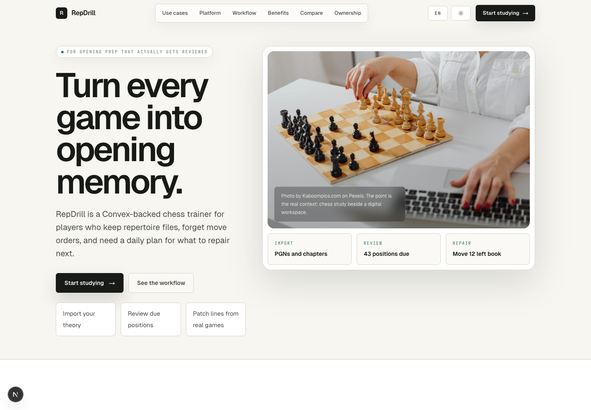
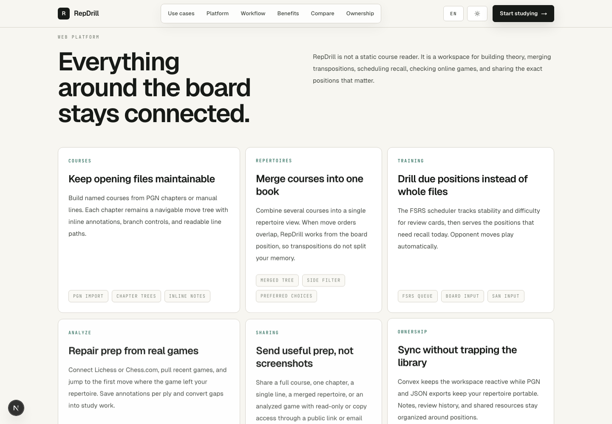
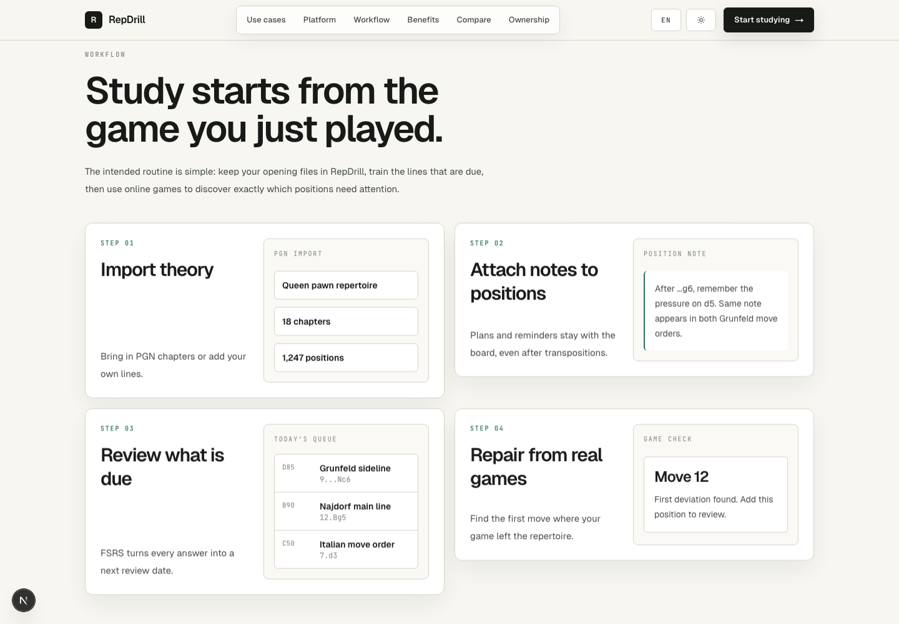
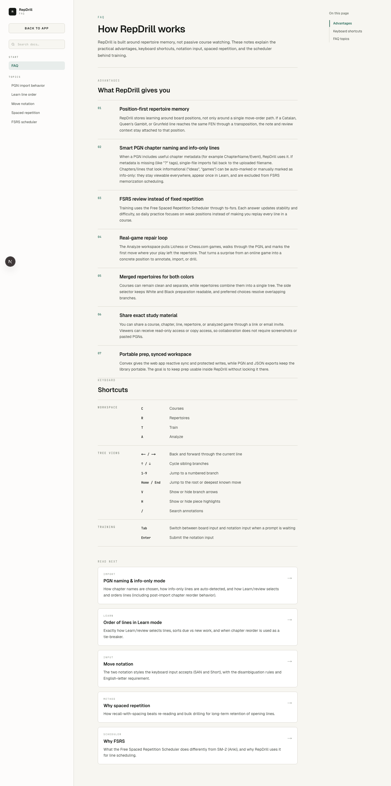

# RepDrill

A self-hostable chess opening repertoire trainer built around position memory, FSRS spaced repetition, real-game repair, and portable user-owned data.

RepDrill is for players who already collect PGNs, coach files, opening notes, or study chapters and want those materials to become a living training system. Import theory, merge it into a repertoire, drill only the positions that are due, then turn recent games into review material.

Built with Next.js 16, React 19, Convex, Convex Auth, chess.js, chessground, and `ts-fsrs`. Licensed under AGPL-3.0.

## Why this matters

Chess opening study has a tooling gap. Many players keep preparation in scattered PGN files, Lichess studies, ChessBase databases, paid course platforms, private notes, or coach messages. Those formats are useful, but they often fail at one of the hard parts: scheduled recall, transpositions, ownership, collaboration, or repair from real games.

RepDrill exists to make high-quality repertoire training more open:

- **For chess players** — study your own repertoire instead of replaying whole files or relying only on generic courses.
- **For coaches** — share exact lines, chapters, repertoires, or analyzed games without turning everything into screenshots and messages.
- **For improvers** — connect real games back to preparation so surprises can become concrete study tasks.
- **For open source** — keep the learning loop inspectable: PGN parsing, position-first data modeling, FSRS scheduling, deviation detection, and export/import are all code the community can audit and improve.
- **For data ownership** — export single courses as PGN, review logs as CSV, or the full library as JSON. The point is to make RepDrill useful without trapping the user's chess work.

## Core product loop

1. **Build** — create courses from PGN files or pasted PGN.
2. **Connect** — combine courses into one repertoire view that understands overlapping move orders.
3. **Train** — review due positions with FSRS instead of grinding every line.
4. **Repair** — pull recent Lichess or Chess.com games, annotate them, and import useful games into study courses.
5. **Share** — send a course, chapter, line, repertoire, or analyzed game with view/copy/collaborate permissions.
6. **Own** — export your prep and review history in standard or structured formats.

## Screenshots









## Features

### Courses

- Create named opening courses for White or Black.
- Import one or more `.pgn` files by drag-and-drop or paste.
- Preserve variations and PGN comments where supported by the parser.
- Split imported material into chapters.
- Use smart chapter naming from `ChapterName`, `Event`, or uploaded filename fallback.
- View each chapter as a navigable move tree.
- Navigate move paths, branches, board positions, annotations, hints, and arrows.
- Edit course names inline from list and detail pages.
- Export a single course as PGN.
- Share a full course, a chapter, or a single line.

### PGN Import And Info-Only Content

- If a PGN game has a meaningful `ChapterName` or `Event`, RepDrill uses it as the chapter name.
- If headers are missing or placeholder values such as `?`, single-file imports fall back to the uploaded filename without `.pgn`.
- RepDrill detects informational material and can mark chapters as `info-only` when it sees terms such as `idea`, `ideas`, `game`, or `games` in filenames, PGN headers, or comments.
- `Info-only` chapters and lines remain visible in course and repertoire views.
- `Info-only` content is not scheduled as FSRS memorization work.
- In Learn/training order, an `info-only` line can be shown once and then treated as viewed.
- Users can manually switch chapter and line type between `training` and `info-only`.

### Repertoires

- Create merged repertoires from multiple courses.
- Combine separate courses into one coherent move tree.
- Keep course files clean while still seeing full preparation together.
- Handle overlapping branches with per-position preferred choices.
- Use a side selector when a repertoire contains both White and Black prep.
- Flip board orientation to the selected side.
- Filter branches by side so mixed-color repertoires stay readable.
- Share repertoire links as read-only public views.
- Rename repertoires inline.

### Training

- FSRS-backed spaced repetition using `ts-fsrs`.
- Server-side card state stored in Convex.
- Drill due and new positions, not whole files.
- Opponent moves play automatically.
- Enter moves on the board or through notation input.
- Supports SAN and documented short notation behavior.
- Rate recall and update stability/difficulty per card.
- Filter training by all lines, a specific course, or a specific repertoire.
- Start training from a particular position when linked from analysis or repertoire context.
- Track review logs for export and later statistics.

### Analyze

- Connect a Lichess username.
- Connect a Chess.com username.
- Fetch recent games from either platform.
- Parse game PGNs into an interactive review board.
- Navigate the full game with board, move list, keyboard shortcuts, last-move highlight, and annotation tools.
- Add per-ply analysis annotations.
- Save analyzed games when sharing or importing.
- Import an analyzed game into a `Game analysis` course as a chapter.
- Review tabs for current analysis, shared-with-you analysis, and analysis you shared.
- Includes a deviation-detection engine and UI model for `in_book`, `left_book`, `no_repertoire_for_color`, and `parse_error` states.
- Full Convex-backed repertoire comparison for fetched games is still roadmap work; the current server action does not yet build the user book from Convex course data.

### Sharing And Collaboration

- Public link sharing through `/share/[token]`.
- Email invitation records for shared resources.
- Resource types: course, repertoire, and analysis game.
- Course scopes: full course, chapter, or line.
- Access levels: `view`, `copy`, and `collaborate` where supported.
- Public shared course viewer.
- Public shared repertoire viewer.
- Public shared analysis viewer with board, PGN navigation, deviation context, and read-only annotations.
- Copy access for importing useful shared material into another library.
- Ownership transfer support for shareable resources.

### Data Ownership

- Full JSON archive export: courses, moves, positions, FSRS state, and review history.
- JSON archive import with position deduplication by FEN.
- Per-course PGN export.
- Review-log CSV export.
- Standard chess notation at the boundaries wherever possible.
- Convex-backed sync for the active workspace without treating the hosted app as the only place the data can live.

### Keyboard-First Workflow

RepDrill is designed to be usable without constantly reaching for the mouse.

- `C`, `R`, `T`, `A` jump between Courses, Repertoires, Train, and Analyze.
- In tree views, arrow keys move through the current line and sibling branches.
- `1`-`9` jump to numbered branches.
- `Home` / `End` jump to the root or deepest known move.
- `V` toggles arrows.
- `H` toggles hints or last-move highlighting, depending on view.
- `/` opens annotation search where available.
- In training, `Tab` switches between board input and notation input.
- `Enter` submits notation input.

### UI And Accessibility-Oriented Details

- Responsive application shell with course, repertoire, training, analysis, settings, and documentation areas.
- Light/dark theme toggle.
- Language preference with current Ukrainian translation work in progress.
- Board controls are consistent across course, repertoire, and analysis viewers.
- Search over course library entries.
- Inline rename and delete flows for library management.

## Documentation

The in-app documentation starts at `/documentation`. The repository also keeps deeper planning and specification notes under `docs/`.

- [`docs/features.md`](docs/features.md) — current platform feature and behavior reference.
- [`docs/notation-spec.md`](docs/notation-spec.md) — accepted move-input notation.
- [`docs/backlog.md`](docs/backlog.md) — running backlog.
- [`docs/plan.md`](docs/plan.md) — sequencing and roadmap rationale.
- [`docs/audit-and-market-research.md`](docs/audit-and-market-research.md) — competitive/product audit notes.
- [`docs/tactics-import-plan.md`](docs/tactics-import-plan.md) — planned tactics import direction.
- [`docs/tactics-import-plan-claude.md`](docs/tactics-import-plan-claude.md) — alternate tactics import implementation notes.
- `/documentation/import-behavior` — PGN chapter naming, info-only detection, and learn ordering.
- `/documentation/learn-order` — how due/new/info-only lines are selected and ordered.
- `/documentation/notation` — notation examples and input rules.
- `/documentation/spaced-repetition` — why spaced repetition matters for opening memory.
- `/documentation/fsrs` — why RepDrill uses FSRS.

## Architecture

### Frontend

- Next.js 16 App Router.
- React 19.
- chessground board UI.
- Tailwind CSS 4.
- Client/server components organized under `src/app`.
- Shared UI under `src/components`.
- Chess, import/export, game, SRS, and repertoire logic under `src/lib`.

### Backend

- Convex queries, mutations, actions, auth, and schema under `convex/`.
- Convex Auth for authenticated writes.
- Tables for users, courses, chapters, moves, positions, review cards, review logs, analyzed games, share links, share invitations, repertoires, repertoire courses, and repertoire choices.
- Position identity is based on normalized FEN so annotations and learning state can survive transpositions.

### Chess Logic

- PGN parsing in [`src/lib/chess/pgn-parser.ts`](src/lib/chess/pgn-parser.ts).
- Move-tree helpers in [`src/lib/chess/tree.ts`](src/lib/chess/tree.ts).
- FEN normalization in [`src/lib/chess/fen.ts`](src/lib/chess/fen.ts).
- Notation normalization in [`src/lib/chess/notation.ts`](src/lib/chess/notation.ts).
- Lichess import in [`src/lib/games/lichess.ts`](src/lib/games/lichess.ts).
- Chess.com import in [`src/lib/games/chesscom.ts`](src/lib/games/chesscom.ts).
- Deviation detection in [`src/lib/games/deviation.ts`](src/lib/games/deviation.ts).

## Getting Started

Install dependencies:

```bash
pnpm install
```

Start the app:

```bash
pnpm run dev
```

Open [http://localhost:3000](http://localhost:3000).

The dev server must run on **port 3000**. If the port is busy, stop the existing process instead of falling back to another port.

For hosted or shared data, configure a Convex deployment and provide:

```bash
NEXT_PUBLIC_CONVEX_URL=
NEXT_PUBLIC_CONVEX_SITE_URL=
```

Also configure the matching Convex Auth provider environment variables required by the deployment.

## Development Commands

```bash
pnpm run dev      # Next.js development server
pnpm run build    # production build
pnpm run start    # start built app
pnpm run lint     # ESLint
```

When editing Convex code, read [`convex/_generated/ai/guidelines.md`](convex/_generated/ai/guidelines.md) first. This project follows Convex's current generated guidance, which may differ from older Convex examples.

When editing Next.js code, read the relevant guide in `node_modules/next/dist/docs/` first. This project uses Next.js 16, whose APIs and conventions may differ from older assumptions.

## Roadmap

The canonical backlog lives in [`docs/backlog.md`](docs/backlog.md), and sequencing lives in [`docs/plan.md`](docs/plan.md). The current direction is:

### Near-Term Reliability

- Audit and finish Ukrainian translations.
- Revisit the current teaching/training method and scope the concrete issue.
- Parse `{bracket}` PGN annotations into course content consistently.
- Verify search behavior and either fix or simplify it.
- Reintroduce robust move sounds.
- Wire Analyze to the actual Convex repertoire book and tighten known false-positive "in book" cases.
- Improve export formats for ChessBase, Chessable, Lichess Study, and plain PGN interoperability.
- Improve the course chapter line viewer's click behavior and visual presentation.

### Training And Study Depth

- Better speed controls for opponent move playback.
- More deliberate chapter/repertoire drill flows.
- Theory vs tactics course modes.
- Tactics-specific session behavior, timing, statistics, and context display.
- Separate statistics views for theory recall and tactics solving.
- Optional daily caps and anti-overwhelm controls on the review queue.

### Sharing And Collaboration

- Clarify and harden sharing semantics.
- Add link expiry and stronger permission controls.
- Improve fork/copy flows for shared courses and lines.
- Make shared analysis more useful as a coach/player review artifact.

### Import And Interoperability

- Better preservation of PGN comments, annotations, and metadata.
- Lossless export/import where possible.
- Lichess Study and ChessBase-friendly export targets.
- Game API caching for recently fetched Lichess/Chess.com games.

### Planned Tactics Import

The long-term tactics import goal is to turn book diagrams or screenshots into trainable positions:

1. Upload a PDF page range or screenshot.
2. Detect board candidates.
3. Convert each diagram into a proposed FEN.
4. Determine side to move from nearby text or diagram markers.
5. Attach solution moves from printed notation or an answer block.
6. Validate legality and parsing.
7. Review and import positions as tactics.

FEN is the canonical bridge format for this pipeline because it fully describes a chess position: pieces, side to move, castling rights, en-passant target, and move counters.

This is planned work, not the current web-platform import flow. See [`docs/tactics-import-plan.md`](docs/tactics-import-plan.md).

## Contribution Ideas

RepDrill has useful entry points for contributors with different interests:

- Chess UX: improve drill flow, line visualization, keyboard navigation, and anti-overwhelm review design.
- Chess logic: strengthen PGN parsing, notation normalization, transposition behavior, and deviation detection.
- Data portability: improve PGN/JSON/CSV exports and import compatibility with other chess tools.
- Backend: optimize Convex queries, reduce read amplification, and harden sharing permissions.
- Education: refine FSRS scheduling UX, learning states, review explanations, and documentation.
- Internationalization: expand and audit Ukrainian and future language support.
- Tactics: help design a clean shared substrate for theory lines and tactics cards.

## License

AGPL-3.0.
